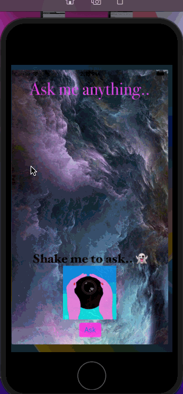

# Magic 8 Ball

## What I have created

We’re going to make a Magic 8 Ball app. You can ask the app to make all your hard decisions! With this app in your pocket, you’ll always have an answer to life’s many conundrums! You can receive the answer either by pressing the ask button or by shaking your phone, which I do in the example .gif above.

## The Goal

The objective of this challenge is to apply the skills I learned in the Dicee tutorial. There’s no new concepts here. Most of the programming skills are gained here through the challenges rather than the tutorials.

